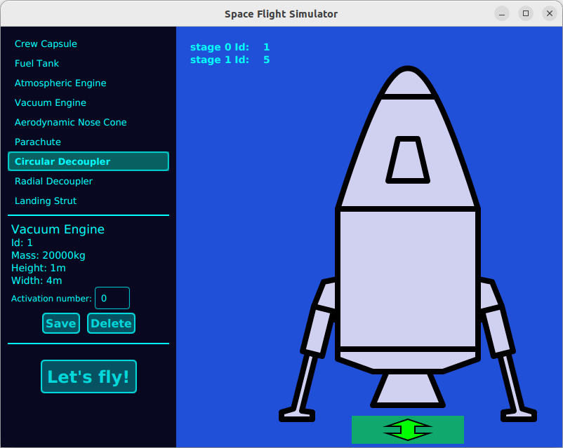
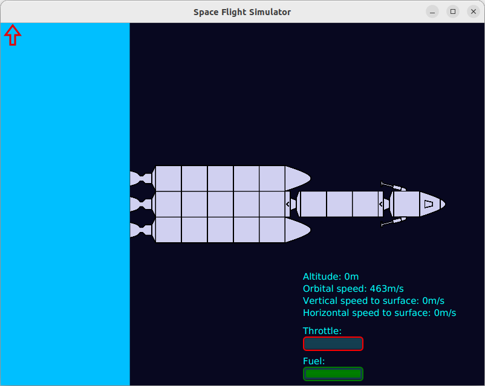
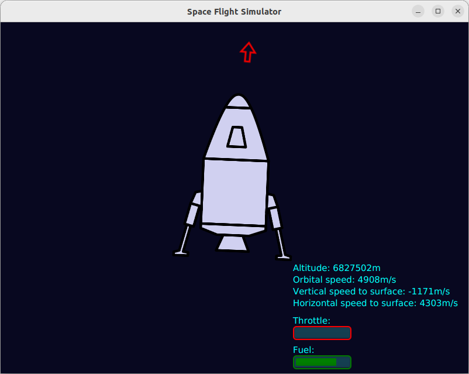
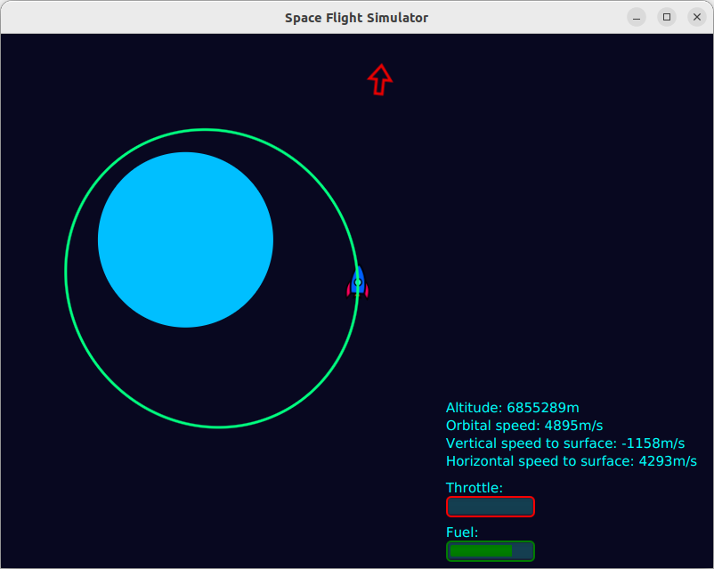

# Space Flight Simulator

Space Flight Simulator is a sandbox game where players can build and fly rockets.
It is inspired by _Kerbal Space Program_ but in a two-dimensional environment.

## Features
- Build complex **rockets with multiple stages**, allowing them to drop emptied fuel tanks and engines.
- Control rockets to take off, orbit, and land (or crash) on various celestial bodies.
- Realistic celestial bodies:
    - Planets and moons follow orbital mechanics and have mass that affects gravity.
    - Celestial bodies can have atmospheres, with density decreasing with altitude.
- Physics-based simulation    
    - Rockets are affected by **collisions, mass, gravity,** and **aerodynamic drag**.
    - The rocket's mass decreases as fuel is burned or when stages separate.
    - Aerodynamic drag is calculated using the atmospheric drag coefficient of each individual rocket component 
    and its surface area that directly faces the atmosphere (perpendicular to the velocity vector). 
    This value is then multiplied by the atmospheric density and the rocket's speed relative to the atmosphere.
- Quality of life features:
    - **The game displays the rocket's projected orbit** based on its current position and velocity relative to celestial bodies.
    - **Time acceleration** to speed up space travel.

## Screenshots From Gameplay

<p align="center">
    <div style="text-align: center; width: 80%;">
        
        <em>Designing a rocket.</em>
    </div>div>
</p>

<p align="center">
    
    <em>Rocket fully assembled on a surface with three stages.</em>
</p>

<p align="center">
    
    <em>Rocket orbiting a planet - close view.</em>
</p>

<p align="center">
    
    <em>Rocket orbiting a planet with projected orbital trajectory. </em>
</p>

## Running on Linux
* Download this repository.
* Install Java 11.
* Download JavaFX 11 from: `https://gluonhq.com/products/javafx/`
* Run the following command:
```java --module-path /path/to/javafx11-sdk/lib --add-modules=javafx.controls --add-modules javafx.controls,javafx.fxml -jar SpaceFlightSimulator.jar```

## License
This project is licensed under the **MIT License**.

You are free to use, modify, and distribute the project, including for commercial purposes, as long as you include the original copyright and license notice.
For more details, see the full license here: [MIT License](https://opensource.org/licenses/MIT)

